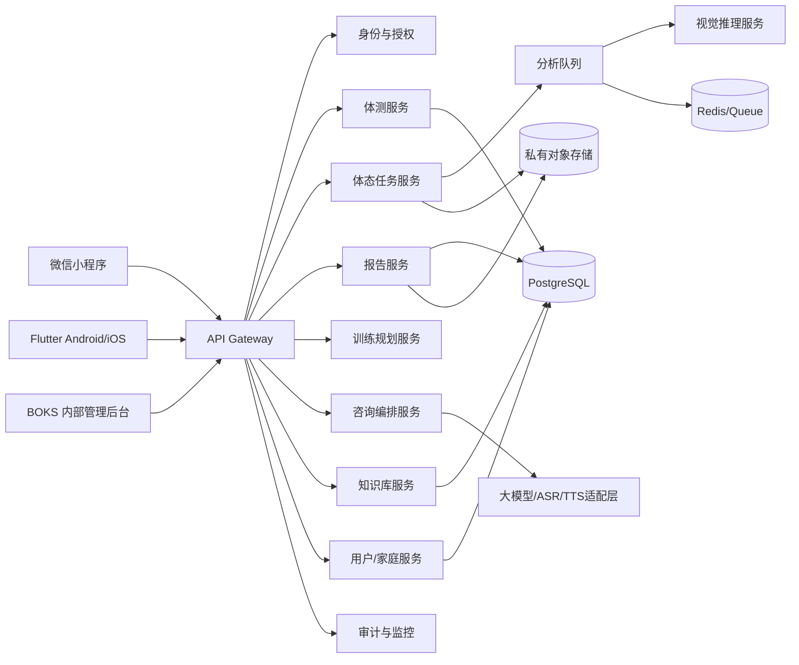

# 04 技术架构设计

## 1. 架构目标

- 让体测评分和姿态分析可独立扩容、独立回滚。
- 让小程序、Android、iOS 和后台共享同一套 API、标准版本和权限模型。
- 让原图、健康数据、评分规则、聊天和审计分域存储。
- 让模型输出必须经过质量门禁、规则校验和安全策略后才进入报告。
- 让知识库更新不会直接改变生产评分，所有发布都可追溯和回滚。

## 2. 技术选型

| 层 | 推荐方案 | 说明 |
| --- | --- | --- |
| 微信小程序 | Taro 4 + React + TypeScript | 组件化、类型安全、适配微信小程序 |
| Android/iOS | Flutter + Dart | 共享业务 UI，摄像头/姿态推理通过原生插件或平台通道 |
| 管理后台 | Next.js + TypeScript + Ant Design | 表格、审核、差异和权限页面开发效率高 |
| API | NestJS + TypeScript | 模块化、OpenAPI、队列和统一校验 |
| AI 推理 | Python FastAPI + ONNX Runtime/PyTorch 服务 | 关键点、图像质量和文本安全策略分离 |
| 主数据库 | PostgreSQL 16 | 事务、JSONB、行级权限扩展 |
| 缓存/队列 | Redis + BullMQ 或托管消息队列 | 会话、幂等、异步分析和通知 |
| 文件存储 | S3 兼容对象存储 | 原图/派生图/报告，私有桶 + 短期签名 URL |
| 搜索 | OpenSearch 或 PostgreSQL FTS | 只搜索已发布的知识库内容 |
| 监控 | OpenTelemetry + Prometheus + Grafana + Sentry | trace、指标、错误和审计告警 |
| CI/CD | GitHub Actions + 镜像仓库 + IaC | 环境隔离、迁移审批、灰度发布 |

产品也可替换基础设施，但必须保留以下接口：对象存储、队列、密钥管理、审计、标准版本发布和模型版本注册。

## 3. 系统边界



## 4. 服务划分

### 4.1 API Gateway

- 校验 JWT/微信登录会话；
- 限流、幂等键、请求 trace_id；
- 校验平台和 App 版本；
- 统一错误格式；
- 不记录照片、音频和完整聊天内容。

### 4.2 身份与授权服务

- 监护人、家庭和内部角色；
- 监护人授权及撤回；
- 数据范围判定；
- 登录设备和会话撤销。

### 4.3 体测服务

- 测量记录草稿和提交；
- 标准版本选择；
- 原始值校验；
- 评分引擎调用；
- 报告输入快照。

### 4.4 体态任务服务

- 拍摄任务、视角和照片质量状态；
- 预签名上传；
- 派生文件清理；
- 分析任务状态；
- 结构化姿态结果。

### 4.5 报告服务

- 组合体测/体态结果；
- 生成结构化 JSON；
- 异步渲染 PDF/分享图；
- 报告版本、撤回和重新生成；
- 低置信度和安全文案。

### 4.6 训练规划服务

- 规则式安全门禁；
- 目标拆解和动作库检索；
- 周计划生成；
- 训练打卡和复测；
- 专业内容版本追踪。

### 4.7 咨询编排服务

- 识别问题类型；
- 加载已授权上下文；
- 检索发布知识库；
- 调用文本模型、ASR/TTS；
- 输出安全检查和引用；
- 触发 BOKS 内部安全工单或家长就医提示。

### 4.8 知识库服务

- 来源、原文、解析、规则包、训练内容、提示词和安全政策；
- 差异对比、双人审核、发布/撤回/回滚；
- 规则适用范围和有效时间；
- 生成可供评分/对话检索的只读快照。

## 5. 数据域和访问边界

| 数据域 | 示例 | 存储 | 默认可见角色 |
| --- | --- | --- | --- |
| 身份域 | 监护人、儿童昵称、出生日期 | PostgreSQL 加密字段 | 监护人、BOKS 内部授权人员 |
| 体测域 | 原始值、单项分、报告 | PostgreSQL | 监护人、BOKS 内部授权人员 |
| 姿态域 | 原图、关键点、观察结果 | 私有对象存储 + PostgreSQL | 监护人；专业复核按授权 |
| 对话域 | 转写、回答、引用 | PostgreSQL/短期对象存储 | 监护人本人 |
| 标准域 | 来源、原文、规则包 | 对象存储 + PostgreSQL | 审核员、后台 |
| 审计域 | 同意、访问、导出、删除、发布 | 追加写入存储 | 审计/安全 |

不要用一张跨域宽表直接保存所有儿童信息。服务间只传递必要的、带授权检查的字段。

## 6. 核心数据流

### 6.1 体测

1. 客户端获取儿童档案摘要和可用指标。
2. 用户创建草稿，服务端返回 `assessment_id`。
3. 提交时生成不可变输入快照和幂等键。
4. 体测服务加载已发布标准版本，执行规则引擎。
5. 保存逐项计算轨迹和结果。
6. 报告服务渲染结构化报告和可选 PDF。

### 6.2 体态

1. 客户端完成监护人授权和拍摄任务。
2. 客户端本地检查，服务端再次检查。
3. 通过短期签名 URL 上传私有对象存储。
4. 队列创建质量检查任务；失败不进入风险分析。
5. 视觉服务输出关键点、质量分和模型版本。
6. 分析服务计算观察指标，应用低置信度策略。
7. 报告服务加入限制、家长就医提示和训练安全文案。

### 6.3 知识库

1. 定时任务只负责发现/下载候选来源。
2. 解析服务生成候选规则包。
3. 审核系统比较原文、候选和现行版本。
4. 发布后生成 `knowledge_snapshot_id`。
5. 报告和对话分别锁定自己的知识快照。

## 7. 异步任务和幂等

任务类型：

- `posture_quality_check`
- `posture_inference`
- `report_render`
- `training_plan_generate`
- `speech_to_text`
- `text_to_speech`
- `knowledge_fetch`
- `knowledge_parse`
- `knowledge_diff`
- `data_erasure`

每个任务包含：

```text
job_id
idempotency_key
tenant_id
subject_id
input_snapshot_id
model_or_rule_version
attempt
status
error_code
created_at / started_at / finished_at
```

任务必须可重试且不重复生成计费/报告；重试使用指数退避和死信队列。

## 8. 安全设计

- 登录令牌短期有效，刷新令牌可撤销；
- 内部访问必须校验 BOKS 角色、工单范围和家庭授权关系；
- 对象存储私有化，下载 URL 默认 5 分钟有效；
- 原图和音频使用独立密钥或前缀，便于按数据域删除；
- KMS 管理数据库字段密钥和对象存储密钥；
- 管理后台强制 MFA 和 IP/设备风险策略；
- 生产数据库禁止开发人员直连；
- 所有导出、批量查看和规则发布写入审计；
- 日志使用 `subject_hash`，不写入姓名、原图 URL、完整手机号和聊天全文。

## 9. 环境

| 环境 | 用途 | 数据 |
| --- | --- | --- |
| local | 开发 | 合成数据和模拟模型 |
| dev | 联调 | 脱敏测试数据 |
| staging | 验收 | 与生产相同的配置形态，使用合成/授权样本 |
| production | 正式服务 | 真实数据，严格审批和审计 |

标准规则和模型版本在环境间通过签名制品晋级，不能直接从开发库复制。

## 10. 可观测性

核心指标：

- API P50/P95/P99；
- 体测评分成功率和拒绝原因；
- 照片质量通过率、各失败原因占比；
- 推理队列延迟、重试和死信；
- 报告生成失败率；
- 知识库抓取成功率、候选数、审核积压；
- 隐私同意、撤回、删除完成时长；
- AI 安全拦截、人工升级和引用缺失。

告警不得包含敏感原文；告警通知只带 job_id、错误码和 trace_id。

## 11. 灾备与恢复

- PostgreSQL PITR + 每日加密备份；
- 对象存储跨可用区复制，按数据保留策略加密；
- 每季度演练从备份恢复单个家庭数据和知识库版本；
- RPO 目标 15 分钟，RTO 目标 2 小时；
- 灾备恢复后先以只读方式校验规则和审计，再开放写入。

## 12. 架构验收

- [ ] 评分引擎不依赖客户端传入的权重和等级。
- [ ] 体态质量失败不会进入风险报告。
- [ ] 所有报告保存输入、标准/规则、模型和知识快照。
- [ ] 删除任务覆盖对象存储和派生索引。
- [ ] 标准发布可回滚，历史报告仍可解释。
- [ ] 队列重复消费不会重复创建报告或产生重复计费。
