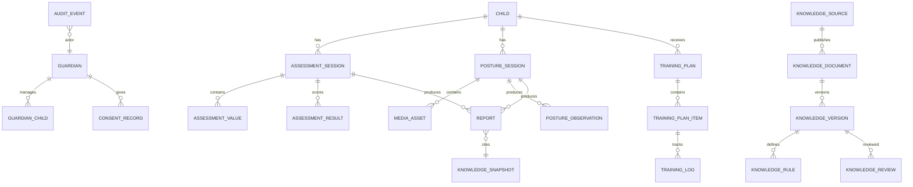

# 08 数据库设计文档

## 1. 设计原则

- 主键使用 UUIDv7 或同等可排序 UUID；公开接口不暴露自增 ID。
- 所有业务表包含 `tenant_id`（家庭或 BOKS 内部工作范围）、`created_at`、`updated_at`。
- 时间统一以 UTC 存储，展示时使用用户时区；知识库调度使用 `Asia/Shanghai`。
- 原始测量值、规则结果、报告文案和模型输出分开存储。
- 标准、规则、模型和报告均不可变；修订产生新版本。
- 敏感字段应用列级加密或应用层信封加密。
- 软删除只用于短期恢复；达到保留期限后必须执行物理删除/匿名化。

## 2. 逻辑关系



## 3. 通用字段和枚举

### 3.1 通用字段

```text
id              uuid primary key
tenant_id       uuid not null
created_at      timestamptz not null
updated_at      timestamptz not null
deleted_at      timestamptz null
version         int not null default 1
```

### 3.2 关键枚举

```text
guardian | child | content_editor | reviewer | auditor | super_admin
draft | submitted | validating | scored | reported | rejected | needs_review
pending | processing | passed | failed | cancelled | expired
candidate | in_review | published | superseded | withdrawn
excellent | good | pass | fail | reference_only | not_scored
```

枚举应在数据库约束和 API schema 中同时定义，新增值必须先完成客户端兼容。

## 4. 身份和家庭域

### 4.1 `guardians`

| 字段 | 类型 | 规则 |
| --- | --- | --- |
| `id` | uuid | 主键 |
| `tenant_id` | uuid | 家庭 ID |
| `phone_ciphertext` | bytea | 加密；可为空 |
| `wechat_openid_hash` | text | 哈希，不保存明文 openid 到日志 |
| `status` | text | active/locked/deleted |
| `mfa_enabled` | boolean | 后台和敏感操作 |

### 4.2 `children`

| 字段 | 类型 | 规则 |
| --- | --- | --- |
| `id` | uuid | 主键 |
| `family_id` | uuid | 家庭范围 |
| `display_name_ciphertext` | bytea | 加密 |
| `birth_date_ciphertext` | bytea | 加密 |
| `sex_code` | text | 标准映射需要；不作价值标签 |
| `school_stage` | text | preschool/primary/junior_high/senior_high |
| `grade_code` | text | 按标准版本解释 |
| `profile_status` | text | active/archived/deleted |
| `data_retention_until` | date | 家庭/产品策略计算 |

### 4.3 `guardian_child`

唯一键：`(guardian_id, child_id)`。字段包括关系、是否主要监护人、授权范围、有效时间和撤回时间。

### 4.4 `consent_records`

保存：

```text
id
guardian_id
child_id
consent_type              -- privacy, photo, audio, ai_context, model_training
policy_version
scope_json
status                    -- granted, withdrawn, expired
granted_at
withdrawn_at
source_platform
evidence_hash
```

不同用途分开同意；撤回照片授权不应自动撤回必要的账号服务授权，但必须阻止新的照片处理。

## 5. BOKS 内部访问域

BOKS 内部账号不建立学校、第三方机构或班级数据域。内部角色通过角色、工单范围和最小必要授权访问知识库、内容审核、家长反馈和安全事件。

建议字段：

```text
boks_staff_id
role
scope
ticket_id
expires_at
```

内部角色不能直接修改儿童原始值、照片和历史报告；任何复核意见都以追加记录保存。

## 6. 体测域

### 6.1 `assessment_sessions`

| 字段 | 类型 | 说明 |
| --- | --- | --- |
| `id` | uuid | 体测任务 |
| `child_id` | uuid | 儿童 |
| `measurement_date` | date | 测量日期 |
| `age_in_months` | int | 计算快照 |
| `school_stage` | text | 提交时快照 |
| `grade_code` | text | 提交时快照 |
| `sex_code` | text | 提交时快照 |
| `standard_version_id` | uuid | 锁定规则 |
| `status` | text | 状态机 |
| `test_status` | text | completed/makeup/exempt/deferred |
| `input_snapshot` | jsonb | 不可变提交快照 |
| `idempotency_key` | text | 唯一 |

### 6.2 `assessment_values`

| 字段 | 类型 | 说明 |
| --- | --- | --- |
| `assessment_id` | uuid | 外键 |
| `indicator_code` | text | 如 `run_50m` |
| `raw_value_decimal` | numeric | 原始值 |
| `unit` | text | 单位 |
| `attempt_no` | smallint | 尝试次数 |
| `measurement_method` | text | 手工/设备/导入 |
| `quality_status` | text | valid/suspect/missing |
| `source_device_id` | text | 可选 |
| `note` | text | 不含不必要健康详情 |

唯一键：`(assessment_id, indicator_code, attempt_no)`。

### 6.3 `assessment_results`

保存每个项目的原始值、标准分、权重、加分、规则命中、四舍五入方式和 `calculation_trace`。不得只存最终总分。

### 6.4 `reports`

| 字段 | 类型 | 说明 |
| --- | --- | --- |
| `id` | uuid | 报告 ID |
| `child_id` | uuid | 儿童 |
| `report_type` | text | assessment/posture/combined |
| `source_session_id` | uuid | 体测或体态任务 |
| `knowledge_snapshot_id` | uuid | 来源快照 |
| `algorithm_version` | text | 算法版本 |
| `model_version` | text | 可为空 |
| `content_json` | jsonb | 结构化报告 |
| `render_object_key` | text | PDF/分享图 |
| `status` | text | ready/failed/revoked |

报告内容 JSON 必须包含限制说明、标准来源、生成时间、输入和版本摘要。

## 7. 体态和媒体域

### 7.1 `posture_sessions`

字段：

```text
id
child_id
capture_protocol_version
consent_record_id
status
required_views_json
quality_summary_json
analysis_result_json
model_version
knowledge_snapshot_id
red_flag_status
```

### 7.2 `media_assets`

| 字段 | 类型 | 规则 |
| --- | --- | --- |
| `id` | uuid | 公开引用 ID |
| `owner_child_id` | uuid | 数据主体 |
| `posture_session_id` | uuid | 所属任务 |
| `asset_type` | text | original/blurred/cropped/keypoints/audio |
| `view_type` | text | front/back/left/right/forward_bend |
| `object_key` | text | 私有桶 |
| `sha256` | text | 完整性 |
| `mime_type` | text | allowlist |
| `size_bytes` | bigint | 限制大小 |
| `retention_until` | timestamptz | 到期清理 |
| `deletion_status` | text | active/queued/deleted |

禁止把对象存储 URL 作为永久公开字段；接口返回短期签名 URL。

### 7.3 `posture_observations`

保存：

- 观察指标和单位；
- 关键点覆盖率；
- 视角、拍摄协议和模型版本；
- 置信度及不确定性；
- 观察性描述；
- 规则命中；
- 是否需要复拍/人工复核/就医提示。

不保存未经授权的人脸识别向量；若端侧模型产生临时特征，任务结束后清除。

## 8. 训练域

### `training_plans`

字段：儿童、来源报告、目标、周期、每周频次、每次时长、计划规则版本、内容版本、状态、暂停原因、家长确认时间。

### `training_plan_items`

字段：周序、日序、动作 ID、热身/主项/放松、组数、次数、节奏、休息、替代动作、安全提示和排序。

### `training_logs`

字段：计划项、完成时间、完成量、主观难度、疼痛/不适标记、备注、输入来源。出现红旗标记后写入安全事件并暂停相关计划。

## 9. 对话和 AI 域

### `conversations`

保存用户、儿童范围、授权上下文、会话状态、创建/结束时间和删除状态。对话不默认关联所有儿童，必须显式选择。

### `messages`

保存角色、加密内容、内容摘要、引用 ID、模型版本、安全分类、是否人工升级和保留期限。

### `ai_runs`

保存模型提供方、模型/提示词版本、输入资产 ID、知识快照、token/耗时、结果安全状态和错误码。生产日志不保存完整 prompt。

## 10. 知识库和版本域

### `knowledge_sources`

保存机构、标准/文号、标题、官方 URL、证据等级、授权状态、监控策略和现行状态。

### `knowledge_documents`

保存来源、原始对象键、文件哈希、内容类型、抓取时间、解析器版本和文件状态。

### `knowledge_versions`

保存版本号、发布日期、生效日期、废止日期、适用人群、差异摘要、发布状态和父版本。

### `knowledge_rules`

保存指标、单位、年龄/学段/性别条件、权重、评分区间、附加分、等级、公式 DSL、来源页码/表格位置和规则测试结果。

### `knowledge_reviews`

保存审核人、角色、检查清单、意见、签名摘要、审核时间和结果。发布需要至少两名不同账号通过。

### `knowledge_snapshots`

将一组已发布标准、姿态规则、训练内容和安全政策锁定为不可变快照；报告和 AI 回答引用快照 ID。

## 11. 审计和删除域

### `audit_events`

追加写入：

```text
actor_id
actor_role
action
resource_type
resource_id
scope
result
trace_id
created_at
metadata_redacted_json
```

### `data_erasure_requests`

记录请求主体、数据范围、验证方式、任务状态、对象清理结果、索引清理结果、备份到期时间和完成证明。

## 12. 索引和查询

- `assessment_sessions(child_id, measurement_date desc)`；
- `reports(child_id, created_at desc)`；
- `media_assets(posture_session_id, deletion_status)`；
- `knowledge_versions(source_id, status, effective_at desc)`；
- `audit_events(resource_id, created_at desc)`；
- 家庭查询必须先按 `tenant_id` 和监护人授权关系过滤；
- 大表按月份或租户分区，照片/音频不进数据库二进制字段。

## 13. 删除和保留

建议默认策略（上线前由法务和 BOKS 服务规则确认）：

| 数据 | 默认策略 |
| --- | --- |
| 原始体态照片 | 报告生成后 30 天，用户可立即删除 |
| 派生裁剪/模糊图 | 与原图一致或更短 |
| 音频 | ASR 确认后 24 小时内删除 |
| 关键点和报告 | 由监护人/BOKS 产品保留策略决定 |
| 聊天 | 90 天或用户立即删除 |
| 审计记录 | 依法/合同要求的最短期限 |
| 权威原文和版本 | 按授权和版权策略留存，不与儿童数据混存 |

删除必须覆盖主库、缓存、搜索索引、对象存储、异步任务和可删除备份；备份无法即时删除时应记录隔离和到期销毁时间。

## 14. 数据质量约束

- 体测原始值不允许修改；修正创建更正记录并重新评分。
- 标准版本必须存在且状态为 `published` 才能评分。
- 报告输入快照和结果快照哈希校验。
- 所有体态结果必须有模型版本和质量门禁结果。
- 幼儿参考结果必须带 `reference_only`，不允许写入小学总分字段。
